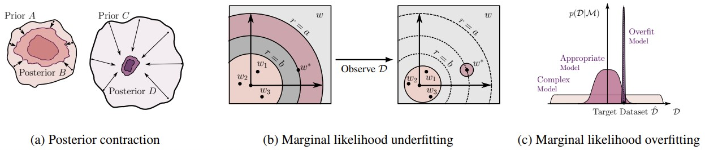
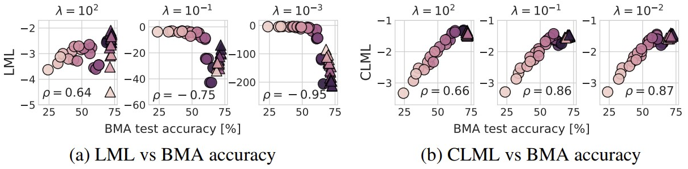
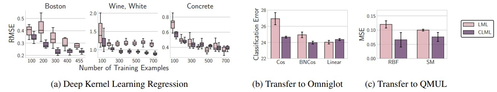

# Bayesian Model Selection, the Marginal Likelihood, and Generalization


This repository contains experiments for the paper [_Bayesian Model Selection, the Marginal Likelihood, and Generalization_](https://arxiv.org/abs/2202.11678) by [Sanae Lotfi](https://sanaelotfi.github.io/), [Pavel Izmailov](https://izmailovpavel.github.io/), [Gregory Benton](g-benton.github.io), [Micah Goldblum](https://goldblum.github.io/), and [Andrew Gordon Wilson](https://cims.nyu.edu/~andrewgw/).


## Introduction

In this paper, we discuss the marginal likelihood as a model comparison tool, and fundamentally re-evaluate whether it is the right metric for predicting generalization of trained models, and learning parameters.
- We discuss the strengths and weaknesses of the marginal likelihood for model selection, hypothesis testing, architecture search and hyperparameter tuning. 
- We show that the marginal likelihood is answering an entirely different question than the generalization question: "how well will my model generalize on unseen data?", which makes the difference between hypothesis testing and predicting generalization.
- We show that optimizing the marginal likelihood can lead to overfitting and underfitting in the function space. 
- We revisit the connection between the marginal likelihood and the training efficiency, and show that models that train faster don't necessarily generalize better or have higher marginal likelihood. 
- We demonstrate how the Laplace approximation of the marginal likelihood can fail in architecture search and hyperparameter tuning of deep neural networks. 
- We study the conditional marginal likelihood and show that it provides a compelling alternative to the marginal likelihood for neural architecture comparison, deep kernel hyperparameter learning, and transfer learning. 




In this repository we provide code for reproducing results in the paper.

Please cite our work if you find it helpful in your work:
```
@article{lotfi2022bayesian,
  title={Bayesian Model Selection, the Marginal Likelihood, and Generalization},
  author={Lotfi, Sanae and Izmailov, Pavel and Benton, Gregory and Goldblum, Micah and Wilson, Andrew Gordon},
  journal={arXiv preprint arXiv:2202.11678},
  year={2022}
}
```

## Requirements

We use the [Laplace](https://github.com/AlexImmer/Laplace) package for Laplace experiments, which requires `python3.8`. It can be installed using `pip` as follows:

```bash
pip install laplace-torch
```

# Experiments

You can reproduce the GP experiments by running the Jupyter notebooks in `./GP_experiments/`. 

## CIFAR-10 and CIFAR-100

To train ResNet and CNN models and compute their Laplace marginal likelihood for CIFAR-10 and CIFAR-100 as in section 6 of the paper, navigate to `./Laplace_experiments/` and run the following: 
```bash
python logml_<dataset>_<models>.py --decay=<weight decay parameter> \
				 --prior_structure=<the structure of the prior: scalar or layerwise> \
                 --hessian_structure=<structure of the hessian approximation: full, kron, diag> \
                 --base_lr=<optimization learning rate> \
                 --use_sgdr=<use cosine lr scheduler> \
                 --optimizehypers=<optimize hyperparameters using Laplace approximation> \
                 --hypers_lr=<learning rate for hyperparameter learning> \
                 --batchnorm=<use batchnorm instead of fixup> \
                 --chk_path=<path to save the checkpoints> \
                 --result_folder=<path to save the results> 
```

The same code can be run to train the models with 80% of the data, then compute the conditional marginal likelihood as follows:

```bash
python logcml_<dataset>_<models>.py --prior_prec_init=<weight decay parameter> \
				 --prior_structure=<the structure of the prior: scalar or layerwise> \
                 --hessian_structure=<structure of the hessian approximation: full, kron, diag> \
                 --base_lr=<optimization learning rate> \
                 --bma_nsamples=<number of posterior samples to average over> \
                 --data_ratio=<ratio of the data to condition on> \
                 --max_iters=<number of iterations to optimize the rescaling parameter of the hessian> \
                 --partialtrain_chk_path=<path to checkpoints of models trained on a fraction of the data> \
                 --fulltrain_chk_path=<path to checkpoints of models trained on the full data> \
                 --result_folder=<path to save the results> 
```




## Deep kernel learning 

To reproduce results for the deep kernel learning experiments, navigate to `./DKL_experiments/` and run the following:

```bash
python exact_runner.py --m=<the number of datapoints on which we condition> \
				 --losstype=<type of the loss> \
                 --dataset=<choice of the dataset> \
                 --ntrain=<number of training points> \
                 --ntrial=<number of trials > 
```

